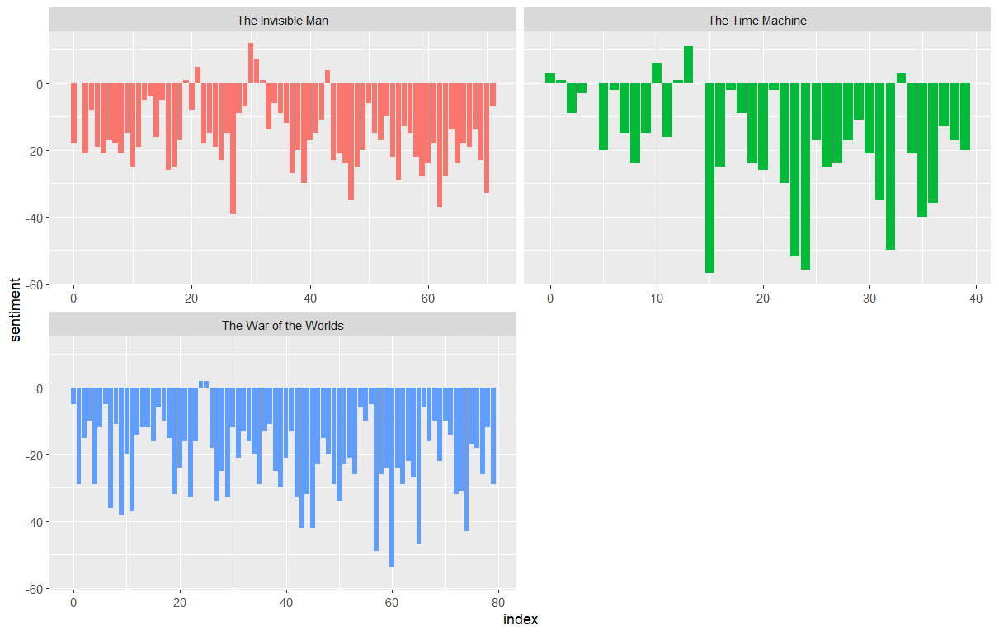
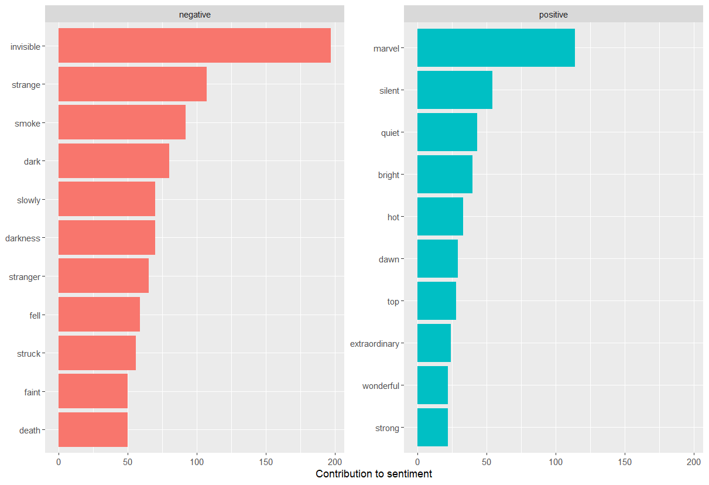

:::::::::::::::::::::::::::::::::::::: questions 

- What is sentment analysis?
- How can text analysis evaluate emotion?

::::::::::::::::::::::::::::::::::::::::::::::::

::::::::::::::::::::::::::::::::::::: objectives

- Analyze sentiment using general-purpose lexicons
- Visualize the sentiment analysis results using column charts 

::::::::::::::::::::::::::::::::::::::::::::::::

## Sentiment Analysis

Sentiment Analysis identifies the emotional tone behind a body of text. When human readers approach a text, we use our understanding of the emotional intent of words to infer whether a section of text is positive or negative, or perhaps characterized by some other more nuanced emotions like surprise or disgust. Sentiment Analysis or opinion mining is a text analysis technique that automatically identifies and extracts the sentiment tone from within text. The analysis utilizes lexicons to help analyze the content as the lexicons have already identified words with the emotional tone that can be compared to other texts.


The `tidytext` package comes with one sentiment lexicon and the `textdata` comes with two others. The lexicons we will use are the sentiment lexicon from [Bing Liu and collaborators]( https://www.cs.uic.edu/~liub/FBS/sentiment-analysis.html), the [NRC Emotion Lexicon]( http://saifmohammad.com/WebPages/NRC-Emotion-Lexicon.htm) from Saif Mohammad and Peter Turney, and the lexicon of [Finn Arup Nielsen]( http://www2.imm.dtu.dk/pubdb/pubs/6010-full.html). These general-purpose lexicons are based on unigrams, i.e., single words from the English language. The `bing` lexicon is from `tidytext` package and categorizes words into positive or negative. The next two lexicons are from the `textdata` package. The `nrc` lexicon categorizes words into emotions anger, sadness, surprise, and joy, and the `afinn` lexicon categorizes words using a score, with negative scores indicating a negative sentiment.

The function `get_sentiments()` allows us to get specific sentiment lexicons with the appropriate measures for each one. Let's look at how each of the lexicons attributes sentiment to the words. 

```r
library(tidytext)
get_sentiments("bing")
```
```output
#> # A tibble: 6,786 × 2
#>    word        sentiment
#>    <chr>       <chr>    
#>  1 2-faces     negative 
#>  2 abnormal    negative 
#>  3 abolish     negative 
#>  4 abominable  negative 
#>  5 abominably  negative 
#>  6 abominate   negative 
#>  7 abomination negative 
#>  8 abort       negative 
#>  9 aborted     negative 
#> 10 aborts      negative 
#> # … with 6,776 more rows
```

```r
library(textdata)
get_sentiments("nrc")
```

```output
#> # A tibble: 13,901 × 2
#>    word        sentiment
#>    <chr>       <chr>    
#>  1 abacus      trust    
#>  2 abandon     fear     
#>  3 abandon     negative 
#>  4 abandon     sadness  
#>  5 abandoned   anger    
#>  6 abandoned   fear     
#>  7 abandoned   negative 
#>  8 abandoned   sadness  
#>  9 abandonment anger    
#> 10 abandonment fear     
#> # … with 13,891 more rows
```

::::::::::::::::::::::::::::::::::::: challenge 

## Challenge 1: Can you do it?

What command in R will display the afinn lexicon?


:::::::::::::::::::::::: solution 

```r
get_sentiments("afinn")
```


## Output
 
```output
#> # A tibble: 2,477 × 2
#>    word       value
#>    <chr>      <dbl>
#>  1 abandon       -2
#>  2 abandoned     -2
#>  3 abandons      -2
#>  4 abducted      -2
#>  5 abduction     -2
#>  6 abductions    -2
#>  7 abhor         -3
#>  8 abhorred      -3
#>  9 abhorrent     -3
#> 10 abhors        -3
#> # … with 2,467 more rows
```

:::::::::::::::::::::::::::::::::


::::::::::::::::::::::::::::::::::::::::::::::::

## Sentiment Analysis with Inner Join

Since we are using tidy data format, sentiment analysis can be done as an inner join. In the same manner with how to remove stop words with antijoin, performing sentiment analysis is an inner join function.

Let's use [The Time Machine](https://www.gutenberg.org/ebooks/35), 
[The War of the Worlds](https://www.gutenberg.org/ebooks/36), and [The Invisilbe Man](https://www.gutenberg.org/ebooks/5230)
as examples. The Gutenberg IDs for each book are as follows 35, 36, and 5230 respectively. We can download
each one by one or download all three novels into one dataframe. 

First, we need to take the text of the novels and convert the text to the tidy format using unnest_tokens(), just as we did in the last lesson. Let’s also set up some other columns to keep track of which row of the book each word comes from; we use group_by and mutate to construct those columns.


```r
library(gutenbergr)
hgwells <- gutenberg_download(c(35, 36, 5230))

 hgwells_books <- hgwells %>%  
    mutate(book = case_when(
      gutenberg_id == 35 ~ "The Time Machine", 
      gutenberg_id == 36 ~ "The War of the Worlds", 
      gutenberg_id == 5230 ~ "The Invisible Man")) %>% 
    group_by(book) %>% 
    mutate(row = row_number())%>% 
    ungroup() %>% 
    unnest_tokens(word,text) %>% 
    anti_join(stop_words)
```


Because we name the count column word in unnest_tokens(), it’s convenient to join with the sentiment lexicons and stop word datasets because they also have columns named word. This makes performing inner joins and anti-joins easier. 

Let’s look at the words with a joy score from the NRC lexicon. What are the most common joy words in the novel The Time Machine. First, let’s use the NRC lexicon and `filter()` for the joy words and then use `inner_join()` to perform the sentiment analysis. Let’s use `count()` from dplyr. What are the most common joy words in The Time Machine? 


```r

nrc_joy <- get_sentiments("nrc") %>% 
  filter(sentiment == "joy")


hgwells_books %>%
  filter(book == "The Time Machine") %>%
  inner_join(nrc_joy) %>%
  count(word, sort = TRUE)
  
```
```output
# A tibble: 164 × 2
   word          n
   <chr>     <int>
 1 found        44
 2 sun          29
 3 green        28
 4 feeling      20
 5 beautiful    12
 6 save         11
 7 comfort      10
 8 humanity     10
 9 perfect       9
10 abundant      8
# … with 154 more rows
```

The tibble that was created found mostly positive words. While some of the words listed (found or humanity) might be used by the author in other ways than joy or positively the lexicon has identify that as a joyous word. 

We can also examine how the positive words change when comparing several books. First, we find a sentiment score for each word using the Bing lexicon and inner_join(). Next, we count up how many positive and negative words there are in defined sections of each book. We define an index here to keep track of where we are in the narrative; this index (using integer division) counts up sections of 80 lines of text. 

Remember  - the `%/%` operator does integer division (x %/% y is equivalent to floor(x/y)) so the index keeps track of which 80-line section of text we are counting up negative and positive sentiment in.

We then use `pivot_wider()` so that we have negative and positive sentiment in separate columns, and lastly calculate a net sentiment (positive - negative).

```r
  hgwells_sentiment <- hgwells_books %>%
    inner_join(get_sentiments("bing")) %>%
    count(book, index = row %/% 80, sentiment) %>%
    pivot_wider(names_from = sentiment, values_from = n, values_fill = 0) %>% 
    mutate(sentiment = positive - negative)
```


Now let's plot the positive and negative words for the H.G. Wells novels. Notice that we are plotting against the index on the x-axis that keeps track of narrative time in sections of text.


```r

ggplot(hgwells_sentiment, aes(index, sentiment, fill = book)) +
  geom_col(show.legend = FALSE) +
  facet_wrap(~book, ncol = 2, scales = "free_x") 
```

The output is a column chart:



## Most common positive and negative words

By implementing `count()` here with arguments of both word and sentiment, we find out how much each word contributed to each sentiment.
 
 
```r 
bing_word_counts <- hgwells_books %>%
  inner_join(get_sentiments("bing")) %>%
  count(word, sentiment, sort = TRUE) 
   
  bing_word_counts
```
```output
# A tibble: 1,761 × 3
   word      sentiment     n
   <chr>     <chr>     <int>
 1 invisible negative    197
 2 marvel    positive    114
 3 strange   negative    107
 4 smoke     negative     92
 5 dark      negative     80
 6 darkness  negative     70
 7 slowly    negative     70
 8 stranger  negative     65
 9 fell      negative     59
10 struck    negative     56
# … with 1,751 more rows
```

This can be shown visually, and we can pipe straight into ggplot2, if we like, because of the way we are consistently using tools built for handling tidy data frames.

```r
bing_word_counts %>%
  group_by(sentiment) %>%
  slice_max(n, n = 10) %>% 
  ungroup() %>%
  mutate(word = reorder(word, n)) %>%
  ggplot(aes(n, word, fill = sentiment)) +
  geom_col(show.legend = FALSE) +
  facet_wrap(~sentiment, scales = "free_y") +
  labs(x = "Contribution to sentiment",
       y = NULL)
  ```
The output is a column chart:



The word “invisible” is coded as negative but since it is used to describe the condition and the main character in one of the books, let's take it out and see how it changes the sentiment. If it were appropriate for our purposes, we could easily add “invisible” to a custom stop-words list using bind_rows(). We could implement that with a strategy such as this：

```r 
custom_stop_words <- tibble(word = c("invisible"), lexicon = c("custom")) %>% 
  bind_rows(stop_words)
  
  custom_stop_words
 ``` 

 ```output 
# A tibble: 1,150 × 2
   word        lexicon
   <chr>       <chr>  
 1 invisible   custom 
 2 a           SMART  
 3 a's         SMART  
 4 able        SMART  
 5 about       SMART  
 6 above       SMART  
 7 according   SMART  
 8 accordingly SMART  
 9 across      SMART  
10 actually    SMART  
# … with 1,140 more rows
```


:::::::::::::::::::::::::::::::::::::::::::::::::::::::::::::::::::: instructor

Inline instructor notes can help inform instructors of timing challenges
associated with the lessons. They appear in the "Instructor View"

::::::::::::::::::::::::::::::::::::::::::::::::::::::::::::::::::::::::::::::::


::::::::::::::::::::::::::::::::::::::::::::::::


::::::::::::::::::::::::::::::::::::: keypoints 

- Define sentiment analysis
- Use sentiments dataset
- Use general-purpose lexicons
- Analyze sentiment in text


::::::::::::::::::::::::::::::::::::::::::::::::

[r-markdown]: https://rmarkdown.rstudio.com/
