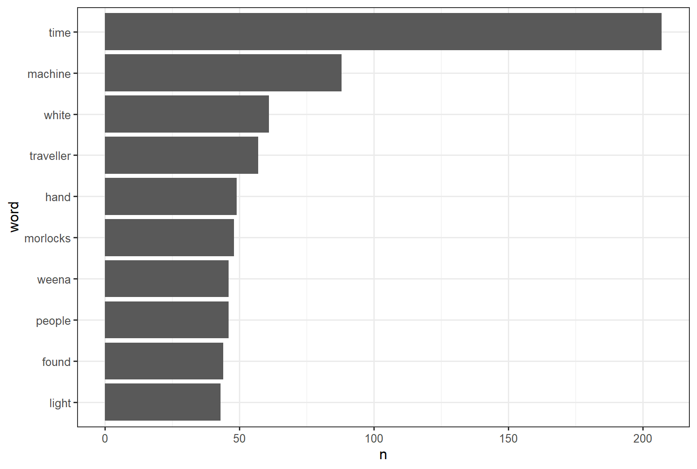

:::::::::::::::::::::::::::::::::::::: questions 

- What is sentment analysis?
- How can text analysis evaluate emotion?

::::::::::::::::::::::::::::::::::::::::::::::::

::::::::::::::::::::::::::::::::::::: objectives

- Analyze sentiment using general-purpose lexicons
- Visualize the sentiment analysis results using column chart and word cloud 

::::::::::::::::::::::::::::::::::::::::::::::::

## Sentiment Analysis

Sentiment Analysis identifies the emotional tone behind a body of text. Sentiment Analysis or opinion mining is a text analysis technique that automatically identify and extracts the sentiment tone from within text. The analysis utilizes lexicons to help analyze the content of the other texts. The lexicons have already identified words the emotional tone that then can be compared to in other texts.


The `tidytext` package comes with three sentiment lexicons in the sentiment’s dataset. The lexicons are the sentiment lexicon from [Bing Liu and collaborators]( https://www.cs.uic.edu/~liub/FBS/sentiment-analysis.html), the [NRC Emotion Lexicon]( http://saifmohammad.com/WebPages/NRC-Emotion-Lexicon.htm) from Saif Mohammad and Peter Turney, and the lexicon of [Finn Arup Nielsen]( http://www2.imm.dtu.dk/pubdb/pubs/6010-full.html). These lexicons are based on unigrams, i.e., single words from the English language. The `bing` lexicon categorizes words into positive or negative, the `nrc` lexicon categorizes words into emotions anger, sadness, surprise, and joy, and the `AFINN` lexicon categorizes words using a score, with negative scores indicating a negative sentiment.

The function `get_sentiments()` allows us to get specific sentiment lexicons with the appropriate measures for each one. Let's look at how each of the lexicons attributes sentiment to the words. 

```r
library(tidytext)
get_sentiments("bing")
```
```output
#> # A tibble: 6,786 × 2
#>    word        sentiment
#>    <chr>       <chr>    
#>  1 2-faces     negative 
#>  2 abnormal    negative 
#>  3 abolish     negative 
#>  4 abominable  negative 
#>  5 abominably  negative 
#>  6 abominate   negative 
#>  7 abomination negative 
#>  8 abort       negative 
#>  9 aborted     negative 
#> 10 aborts      negative 
#> # … with 6,776 more rows
```

```r
get_sentiments("nrc")
```

```output
#> # A tibble: 13,901 × 2
#>    word        sentiment
#>    <chr>       <chr>    
#>  1 abacus      trust    
#>  2 abandon     fear     
#>  3 abandon     negative 
#>  4 abandon     sadness  
#>  5 abandoned   anger    
#>  6 abandoned   fear     
#>  7 abandoned   negative 
#>  8 abandoned   sadness  
#>  9 abandonment anger    
#> 10 abandonment fear     
#> # … with 13,891 more rows
```

::::::::::::::::::::::::::::::::::::: challenge 

## Challenge 1: Can you do it?

What command in R will display the afinn lexicon?

```r
get_sentiments("afinn")
```

:::::::::::::::::::::::: solution 

## Output
 
```output
#> # A tibble: 2,477 × 2
#>    word       value
#>    <chr>      <dbl>
#>  1 abandon       -2
#>  2 abandoned     -2
#>  3 abandons      -2
#>  4 abducted      -2
#>  5 abduction     -2
#>  6 abductions    -2
#>  7 abhor         -3
#>  8 abhorred      -3
#>  9 abhorrent     -3
#> 10 abhors        -3
#> # … with 2,467 more rows
```

:::::::::::::::::::::::::::::::::


::::::::::::::::::::::::::::::::::::::::::::::::

## Sentiment Analysis with Inner Join

Since we are using tidy data format, sentiment analysis can be done as an inner join. In the same manner with how to remove stop words with antijoin, performing sentiment analysis is an inner join function.

First, we need to take the text of the novels and convert the text to the tidy format using unnest_tokens(), just as we did in last lesson. Let’s also set up some other columns to keep track of which line and chapter of the book each word comes from; we use group_by and mutate to construct those columns.


Let’s look at the words with a joy score from the NRC lexicon. What are the most common joy words in The Time Machine. First, let’s use the NRC lexicon and filter() for the joy words. Next, let’s filter() the data frame with the text from the books for the words from Emma and then use inner_join() to perform the sentiment analysis. What are the most common joy words in Emma? Let’s use count() from dplyr.


```r
library(gutenbergr)
library(dplyr)


nrc_joy <- get_sentiments("nrc") %>% 
  filter(sentiment == "joy")


tidy_time_machine <- time_machine %>% 
   inner_join(nrc-joy) %>%
   count(word, sort = TRUE)
  
tidy_time_machine
```


Beyond displaying the word frequencies in a table, we can also visualize it using the package [ggplot2](https://cran.r-project.org/web/packages/ggplot2/index.html)
or the packages [wordcloud](https://cran.r-project.org/web/packages/wordcloud/wordcloud.pdf).

```r
tidy_time_machine %>% 
  count(word, sort = TRUE) %>%
  filter(n > 40) %>% 
  mutate(word = reorder(word, n)) %>% 
  ggplot(aes(n, word))+
  geom_col()+
  theme_bw()
```
The output is a column chart:



```r
count_time_machine <- tidy_time_machine %>% 
  count(word, sort = TRUE)
  
wordcloud(words = count_time_machine$word,
          freq = count_time_machine$n,
          random.order = FALSE,
          max.words = 100,
          colors = brewer.pal(8,"Dark2"))
```


::::::::::::::::::::::::::::::::::::: challenge 

## Challenge 2: Can you create wordcloud using the package `wordcloud`?

Display the word frequencies of the clean data of the three novels by H.G. Wells that appear over 100 times.

:::::::::::::::::::::::: solution 

## Output

```r
tidy_hgwells %>% 
  count(word, sort = TRUE) %>% 
  filter(n > 100) %>% 
  mutate(word = reorder(word, n)) %>% 
  ggplot(aes(word, n)) +
    geom_col() +
    xlab(NULL) +
    coord_flip()
```


:::::::::::::::::::::::::::::::::

::::::::::::::::::::::::::::::::::::::::::::::::


This is a lesson created via The Carpentries Workbench. It is written in
[Pandoc-flavored Markdown](https://pandoc.org/MANUAL.txt) for static files and
[R Markdown][r-markdown] for dynamic files that can render code into output. 
Please refer to the [Introduction to The Carpentries 
Workbench](https://carpentries.github.io/sandpaper-docs/) for full documentation.

What you need to know is that there are three sections required for a valid
Carpentries lesson template:

 1. `questions` are displayed at the beginning of the episode to prime the
    learner for the content.
 2. `objectives` are the learning objectives for an episode displayed with
    the questions.
 3. `keypoints` are displayed at the end of the episode to reinforce the
    objectives.

:::::::::::::::::::::::::::::::::::::::::::::::::::::::::::::::::::: instructor

Inline instructor notes can help inform instructors of timing challenges
associated with the lessons. They appear in the "Instructor View"

::::::::::::::::::::::::::::::::::::::::::::::::::::::::::::::::::::::::::::::::

::::::::::::::::::::::::::::::::::::: challenge 

## Challenge 1: Can you do it?

What is the output of this command?

```r
paste("This", "new", "lesson", "looks", "good")
```

:::::::::::::::::::::::: solution 

## Output
 
```output
[1] "This new lesson looks good"
```

:::::::::::::::::::::::::::::::::


## Challenge 2: how do you nest solutions within challenge blocks?

:::::::::::::::::::::::: solution 

You can add a line with at least three colons and a `solution` tag.

:::::::::::::::::::::::::::::::::
::::::::::::::::::::::::::::::::::::::::::::::::

## Figures

You can also include figures generated from R Markdown:

```{r pyramid, fig.alt = "pie chart illusion of a pyramid", fig.cap = "Sun arise each and every morning"}
pie(
  c(Sky = 78, "Sunny side of pyramid" = 17, "Shady side of pyramid" = 5), 
  init.angle = 315, 
  col = c("deepskyblue", "yellow", "yellow3"), 
  border = FALSE
)
```

Or you can use standard markdown for static figures with the following syntax:

`{alt='alt text for
accessibility purposes'}`

{alt='Blue Carpentries hex person logo with no text.'}

## Math

One of our episodes contains $\LaTeX$ equations when describing how to create
dynamic reports with {knitr}, so we now use mathjax to describe this:

`$\alpha = \dfrac{1}{(1 - \beta)^2}$` becomes: $\alpha = \dfrac{1}{(1 - \beta)^2}$

Cool, right?

::::::::::::::::::::::::::::::::::::: keypoints 

- Use general purpose lexicons
- Use sentiments dataset


::::::::::::::::::::::::::::::::::::::::::::::::

[r-markdown]: https://rmarkdown.rstudio.com/
